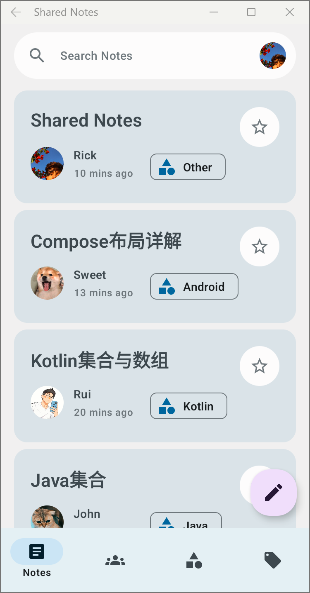

# SharedNotes

[](https://mit-license.org/)
[](https://github.com/JetBrains/kotlin)
[](https://github.com/JetBrains/compose-jb)


A note-taking application that supports real-time sharing, Markdown syntax, and supports Android
platform and Desktop platform (Windows, MacOS, Linux).

- 🧑‍💻 Support 📱Android and 💻Desktop Platform
- 🎉 Adaptive apps for PC, mobile, tablets and foldables
- 📖 Support Markdown syntax
- 🍪 [Material Design 3](https://m3.material.io/)
- 🌈 [Dynamic color](https://m3.material.io/styles/color/dynamic-color/overview)

### Overview


### Light & Dark Theme(PC)


### Light & Dark Theme(Android)

Support [Dynamic color](https://m3.material.io/styles/color/dynamic-color/overview)

|                   Light                   |                  Dark                   |
|:-----------------------------------------:|:---------------------------------------:|
|  |  |

### 🎉 Adaptive apps for PC

#### Adaptive Notes


#### Adaptive Edition


### 🎉 Adaptive apps for mobile, tablets and foldables

Reference from [compose-samples/Reply](https://github.com/android/compose-samples/tree/main/Reply)

**Expanded**


| Medium                                      | Compact                                       |
|---------------------------------------------|-----------------------------------------------|
|  |  |

## Essay

Hi guys! I am very happy to participate in the Kotlin Multiplatform contest. My English is not very
good, there can be grammatical errors or fuzzy phrases in this essay, pardon me.

### My Background

I am a junior from Nanjing, China, majoring in software engineering. I love new technology like
kotlin and that's why I found it and participated in this competition. New technology is very cool.
Absolutely android development is my favorite.

### Project Background

In our class, many students have the habit of taking class notes.

But when we wanted to share our notes with other classmates in real time, trouble came. We can't sit
together every time, and sometimes we must take online classes because of the COVID-19. It's also
not convenient to communicate using chat software like WeChat. For example, to show Markdown. So, I
developed Shared Notes, which is a note-taking application that supports real-time sharing, Markdown
syntax, and supports Android platform and Desktop platform (Windows, MacOS, Linux). Limited to my
hardware device, there is no iOS version now, but it is planned.

Depending on time and current personal skills, I have only developed clients for Android and
Desktop, which share the full data layer and 75% of the UI layer code. Both Android and desktop
platforms support responsive layouts to accommodate devices of different sizes.

Limited to time and personal current state of technology, I only developed Android and Desktop
clients, which fully share the data layer and share 75% of the interface layer code. Whether it's
Android or desktop, they all support responsive layouts to suit devices of different sizes.

### Brief introduction

The program consists of five modules: edition, notes, contacts, categories, and tags. Edition
involves editing and sharing your notes, supporting Markdown syntax and dual-screen preview. Notes
display notes there are shared by contacts in real time. Contacts may provide the function of
viewing and managing contacts (not implemented). And the feature of viewing and managing note
categories and tags (not implemented) is supplied by Categories and Tags.

# Dependencies

| repository                                                                                     | stars                                                                                  |
|------------------------------------------------------------------------------------------------|----------------------------------------------------------------------------------------|
| [compose-jb](https://github.com/JetBrains/compose-jb)                                          |                      |
| [moko resources](https://github.com/icerockdev/moko-resources)                                 |                 |
| [markdown](https://github.com/JetBrains/markdown)                                              |                        |
| [PreCompose](https://github.com/Tlaster/PreCompose)                                            |                        |
| [multiplatform-markdown-renderer](https://github.com/mikepenz/multiplatform-markdown-renderer) |  |

# LICENSE

```
MIT License

Copyright (c) 2023 Ruiyu

Permission is hereby granted, free of charge, to any person obtaining a copy
of this software and associated documentation files (the "Software"), to deal
in the Software without restriction, including without limitation the rights
to use, copy, modify, merge, publish, distribute, sublicense, and/or sell
copies of the Software, and to permit persons to whom the Software is
furnished to do so, subject to the following conditions:

The above copyright notice and this permission notice shall be included in all
copies or substantial portions of the Software.

THE SOFTWARE IS PROVIDED "AS IS", WITHOUT WARRANTY OF ANY KIND, EXPRESS OR
IMPLIED, INCLUDING BUT NOT LIMITED TO THE WARRANTIES OF MERCHANTABILITY,
FITNESS FOR A PARTICULAR PURPOSE AND NONINFRINGEMENT. IN NO EVENT SHALL THE
AUTHORS OR COPYRIGHT HOLDERS BE LIABLE FOR ANY CLAIM, DAMAGES OR OTHER
LIABILITY, WHETHER IN AN ACTION OF CONTRACT, TORT OR OTHERWISE, ARISING FROM,
OUT OF OR IN CONNECTION WITH THE SOFTWARE OR THE USE OR OTHER DEALINGS IN THE
SOFTWARE.
```
